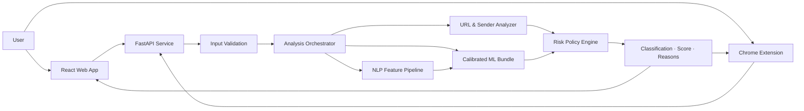

<div align="center">
  

  # NEXUS

  ### AI-Powered Phishing Detection & Risk Analysis

  **A secure, explainable, and production-ready platform for analyzing emails, URLs, and text.**

  Developed by **Nexus Team** as a graduation project for the
  **Samsung Innovation Campus — Artificial Intelligence Program**.

  [](https://github.com/sic-graduation-project/phishing-email-detector/actions/workflows/ci.yml)
  [](https://www.python.org/)
  [](https://fastapi.tiangolo.com/)
  [](https://react.dev/)
  [](https://www.typescriptlang.org/)
  [](https://scikit-learn.org/)
  [](https://render.com/)

  [**Launch Nexus**](https://nexus-phishing-detector.onrender.com) ·
  [**API Documentation**](https://nexus-phishing-api.onrender.com/docs) ·
  [**Report an Issue**](https://github.com/sic-graduation-project/phishing-email-detector/issues)
</div>

---

## Overview

Nexus is an end-to-end phishing detection platform that combines Natural
Language Processing, URL and sender analysis, a calibrated machine-learning
classifier, and explainable risk policies. It provides a modern web dashboard,
a REST API, and a Chrome extension for fast analysis directly from the browser.

The system accepts three input types:

| Input | What Nexus analyzes | Output |
|---|---|---|
| ✉️ **Email** | Sender, subject, body, language patterns, and embedded URLs | Classification, risk score, and reasons |
| 🔗 **URL** | Protocol, domain, IP usage, shorteners, subdomains, parameters, and suspicious terms | URL-specific risk assessment |
| 📝 **Text** | Social-engineering language, urgency, credential requests, and embedded links | Explainable text risk assessment |

> [!NOTE]
> Render free-tier services may require a short cold-start period on the first
> request after inactivity.

## Product Highlights

- 🛡️ **Multi-layer detection** — combines ML inference with deterministic
  security policies instead of relying on a single signal.
- 🧠 **Calibrated machine learning** — uses TF-IDF, numeric NLP features, and
  URL-derived features with a stored production decision threshold.
- 🔍 **Explainable results** — every scan returns a classification, a risk
  score from 0–100, and human-readable reasons.
- ⚡ **Real-time API** — FastAPI endpoints for email, URL, and text analysis.
- 🖥️ **Modern dashboard** — responsive React interface with analysis history,
  notifications, dark mode, and risk visualization.
- 🧩 **Chrome extension** — scans selected text or links from the browser
  context menu using the live Nexus API.
- 🚦 **Production safeguards** — request validation, CORS controls, rate
  limiting, safe errors, health checks, and CI automation.
- 📦 **Atomic model artifact** — model, vectorizer, scaler, feature order,
  threshold, and metadata are versioned together in one bundle.

## System Architecture



### Detection flow

```text
Input → Validation → Feature Extraction → ML / Type-Specific Policy
      → Risk Aggregation → Explainable Result → Web App or Extension
```

## Technology Stack

| Layer | Technologies |
|---|---|
| 🎨 Frontend | React 19, TypeScript, Vite, Tailwind CSS, Framer Motion, Recharts, Lucide |
| ⚙️ Backend | Python, FastAPI, Uvicorn, Pydantic |
| 🤖 AI / ML | scikit-learn, pandas, NumPy, SciPy, NLTK, TF-IDF, calibrated Linear SVC |
| 🔎 URL intelligence | `urllib`, `ipaddress`, `tldextract`, custom security heuristics |
| 🧩 Browser integration | Chrome Extension Manifest V3 |
| ✅ Quality | Pytest, oxlint, TypeScript compiler, GitHub Actions |
| ☁️ Deployment | Render web service and static site |

## Model Evaluation

The production classifier uses sender-disjoint partitions to reduce identity
leakage. Training, probability calibration, threshold selection, and final
testing use separate partitions.

| Metric | Final test result |
|---|---:|
| Accuracy | **99.07%** |
| Precision | **98.55%** |
| Recall | **99.79%** |
| F1 score | **99.17%** |
| ROC-AUC | **99.94%** |
| False positives | **64** |
| False negatives | **9** |

Full evaluation metadata is available in
[`models/evaluation_report.json`](models/evaluation_report.json). Details of
the training and leakage-control strategy are documented in
[`src/ml/Readme.md`](src/ml/Readme.md).

> [!IMPORTANT]
> These results describe the repository's locked test partition. They are not a
> guarantee of performance against future attacks. Independent, time-based,
> and continuously refreshed evaluation remains essential for production use.

## Live Services

| Service | URL |
|---|---|
| 🌐 Web application | [nexus-phishing-detector.onrender.com](https://nexus-phishing-detector.onrender.com) |
| ❤️ API health | [nexus-phishing-api.onrender.com/api/v1/health](https://nexus-phishing-api.onrender.com/api/v1/health) |
| 📘 Swagger UI | [nexus-phishing-api.onrender.com/docs](https://nexus-phishing-api.onrender.com/docs) |
| 📕 ReDoc | [nexus-phishing-api.onrender.com/redoc](https://nexus-phishing-api.onrender.com/redoc) |

## API Reference

Base URL:

```text
https://nexus-phishing-api.onrender.com
```

| Method | Endpoint | Purpose |
|---|---|---|
| `GET` | `/api/v1/health` | Verify service and model readiness |
| `POST` | `/api/v1/analyze/email` | Analyze an email body with optional sender and subject |
| `POST` | `/api/v1/analyze/url` | Analyze a single HTTP or HTTPS URL |
| `POST` | `/api/v1/analyze/text` | Analyze plain text or a message |

<details>
<summary><strong>Example: analyze an email</strong></summary>

```bash
curl -X POST "https://nexus-phishing-api.onrender.com/api/v1/analyze/email" \
  -H "Content-Type: application/json" \
  -d '{
    "sender": "Security Team <security@example.com>",
    "subject": "Urgent account verification",
    "body": "Verify your password now at http://192.168.1.10/login"
  }'
```

```json
{
  "input_type": "email",
  "classification": "Phishing",
  "risk_score": 90.0,
  "reasons": [
    "URL contains an IP address",
    "URL uses HTTP instead of HTTPS"
  ]
}
```

</details>

<details>
<summary><strong>Example: analyze a URL</strong></summary>

```bash
curl -X POST "https://nexus-phishing-api.onrender.com/api/v1/analyze/url" \
  -H "Content-Type: application/json" \
  -d '{"url":"http://secure-login.example.test/update-password"}'
```

</details>

The complete request and response contract is available in
[`backend/API_DOCUMENTATION.md`](backend/API_DOCUMENTATION.md).

## Run Locally

### Prerequisites

- Git
- Python 3.14
- Node.js 24 and npm

### 1. Clone the repository

```bash
git clone https://github.com/sic-graduation-project/phishing-email-detector.git
cd phishing-email-detector
```

### 2. Start the API

Create and activate a virtual environment:

```bash
python -m venv .venv
```

<details>
<summary>Activate the environment</summary>

**Windows PowerShell**

```powershell
.\.venv\Scripts\Activate.ps1
```

**Linux / macOS**

```bash
source .venv/bin/activate
```

</details>

Install dependencies and run FastAPI:

```bash
python -m pip install --upgrade pip
python -m pip install -r requirements.txt
python -m uvicorn backend.app.main:app --host 0.0.0.0 --port 8000
```

Local API documentation will be available at
[`http://127.0.0.1:8000/docs`](http://127.0.0.1:8000/docs).

### 3. Start the web application

Open a second terminal:

```bash
cd frontend
npm ci
npm run dev
```

Open [`http://localhost:5173`](http://localhost:5173).

### 4. Configure environment variables

The development defaults work with ports `8000` and `5173`. For custom
environments, configure:

| Variable | Service | Description |
|---|---|---|
| `CORS_ORIGINS` | Backend | Comma-separated frontend origins allowed by the API |
| `ANALYSIS_RATE_LIMIT_PER_MINUTE` | Backend | Per-client analysis request limit; defaults to `60` |
| `VITE_API_BASE_URL` | Frontend | Public origin of the Nexus API |

## Testing & Quality Checks

Run the complete Python test suite from the repository root:

```bash
python -m pytest -q
```

Run frontend validation:

```bash
cd frontend
npm ci
npm run lint
npm run build
```

GitHub Actions runs both pipelines on every push and pull request to protect
the stability of `main`.

## Chrome Extension

The included Manifest V3 extension allows users to scan selected text and links
without opening the dashboard first.

1. Open `chrome://extensions/`.
2. Enable **Developer mode**.
3. Select **Load unpacked**.
4. Choose the repository's `extension` directory.
5. Select text or right-click a link and choose the Nexus scan action.

The production extension points to the deployed API. No API secrets are stored
in the extension. See [`extension/README.md`](extension/README.md) for its full
usage and privacy notes.

## Deployment

The repository contains a Render Blueprint in [`render.yaml`](render.yaml) with
two services:

- `nexus-phishing-api` — Python web service running FastAPI.
- `nexus-phishing-detector` — static React application.

Deploy from the stable `main` branch and configure the public frontend origin in
`CORS_ORIGINS`. The frontend receives the API origin through
`VITE_API_BASE_URL` during its build.

## Repository Structure

```text
phishing-email-detector/
├── backend/                 FastAPI application, schemas, services, and tests
├── frontend/                React dashboard and client-side history
├── extension/               Chrome Manifest V3 extension
├── src/
│   ├── ml/                  Training, evaluation, artifacts, and inference
│   └── url_analysis/        Runtime URL and sender feature extraction
├── data/                    Processed data and generated feature datasets
├── models/                  Versioned production model bundle and reports
├── notebooks/               Data preparation and exploratory notebooks
├── tests/                   Integration and regression tests
├── .github/workflows/       Continuous integration pipeline
├── render.yaml              Production deployment blueprint
└── requirements.txt         Python runtime and test dependencies
```

## Security & Privacy

- Never commit passwords, tokens, API keys, private datasets, or `.env` files.
- The public API validates input sizes and types before analysis.
- Analysis routes are protected by a per-client sliding-window rate limiter.
- API errors do not expose internal implementation details.
- The browser extension only scans content after an explicit user action.
- Selected text and links are sent to the configured Nexus API for analysis;
  users should not submit secrets or private tokens.
- Detection results support human judgment and should not be treated as a
  substitute for a complete organizational security program.

If you discover a security issue, avoid publishing sensitive exploit details in
a public issue. Contact the project team through the Samsung Innovation Campus
project channel.

## Development Workflow

`main` is the stable, deployable branch. New work should be developed in a
focused branch and merged only after review and successful checks.

```text
Feature branch → Commit → Push → Pull Request → Review → CI → main
```

Recommended commit format:

```text
type(scope): concise description
```

Examples:

```text
feat(api): add attachment analysis endpoint
fix(ml): preserve production feature order
test(frontend): cover failed scan state
docs(readme): update deployment guide
```

## Team Nexus

| Member | Primary responsibility |
|---|---|
| **Eng. Heba** | Dataset and data preprocessing |
| **Eng. Buthaina** | NLP and text feature engineering |
| **Eng. Sulaiman** | Machine-learning development and evaluation |
| **Eng. Rayan** | URL and email-header analysis |
| **Eng. Anas** | Backend, API, and system integration |
| **Eng. Amal** | Frontend and dashboard experience |

## Academic Notice

This repository was created as an independent student graduation project within
the **Samsung Innovation Campus** program. It is not an official Samsung product
or security service. Samsung and Samsung Innovation Campus names and trademarks
belong to their respective owners.

## Copyright and License

Copyright © 2026 **Nexus Team**. All rights reserved.

This project is provided for viewing and evaluation as a graduation project.
Copying, modification, redistribution, publication, deployment, or creation of
derivative works requires prior written permission from Nexus Team. See the
[LICENSE](LICENSE) file for the complete terms. Third-party dependencies,
datasets, names, and trademarks remain subject to their respective licenses
and ownership terms.

---

<div align="center">
  <strong>NEXUS — Smarter Analysis for a Safer Tomorrow</strong>
  <br />
  <sub>Built with teamwork, responsible AI, and security-first engineering.</sub>
  <br /><br />
  © 2026 Nexus Team. All rights reserved.
</div>
