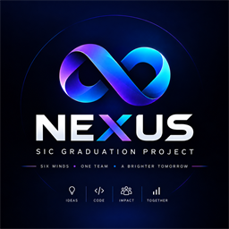
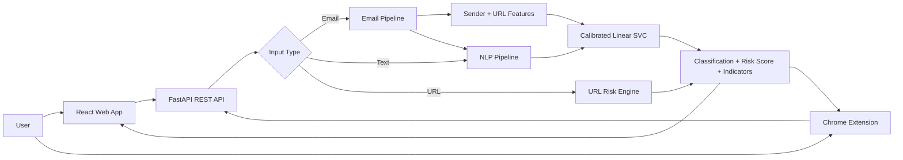
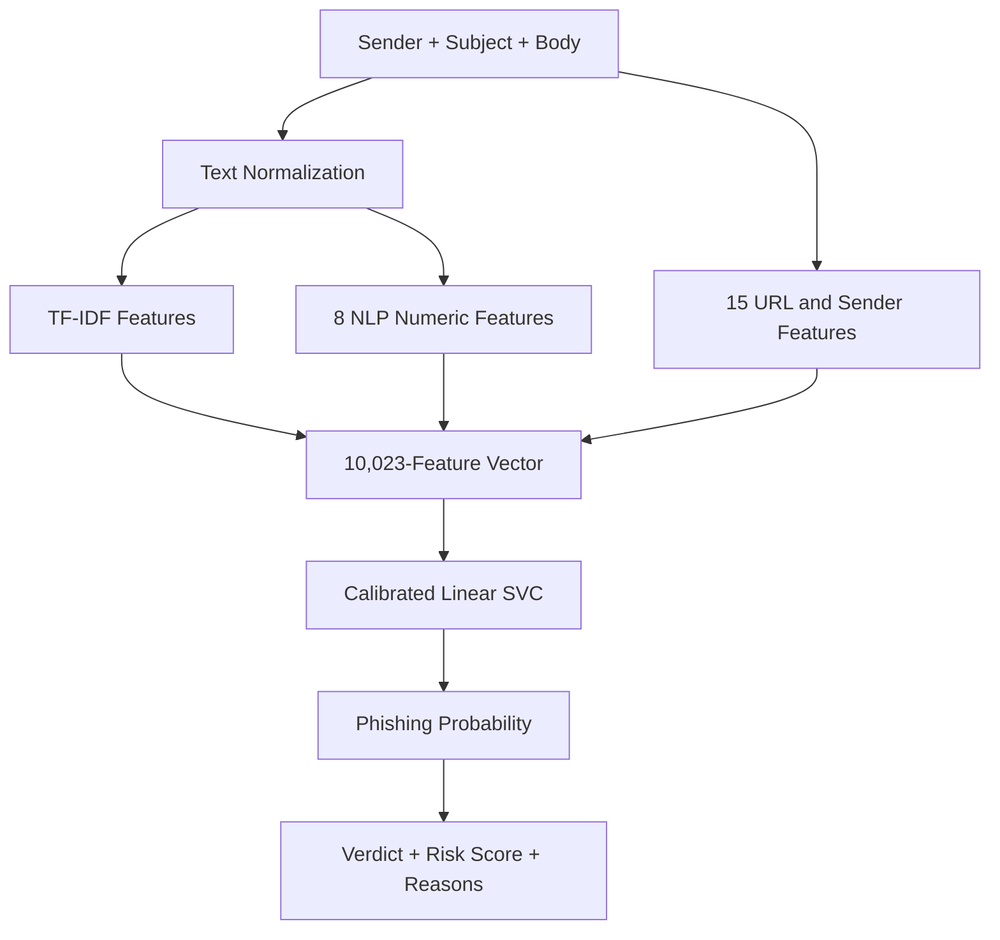
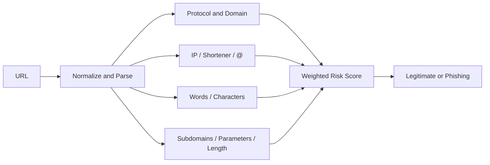
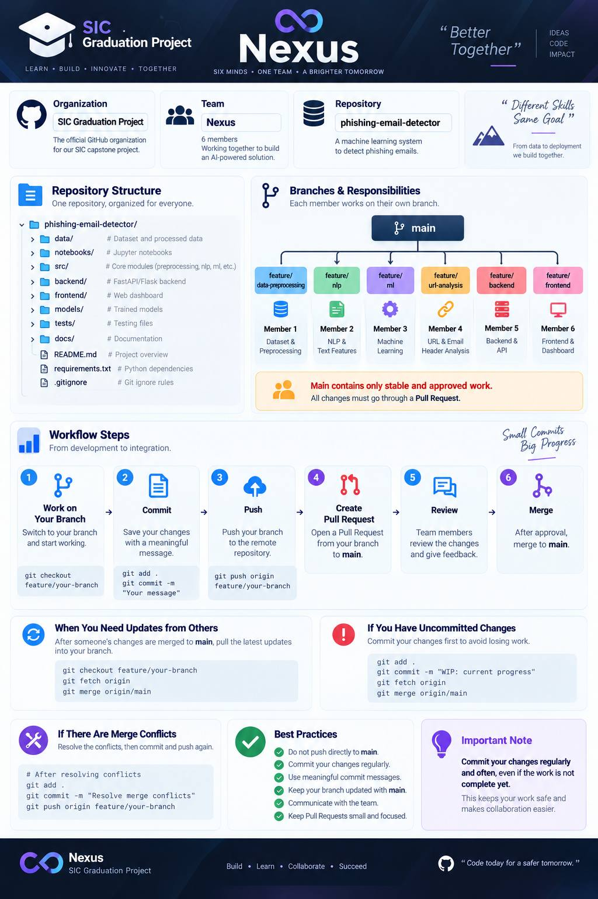

<div align="center">



# Nexus — AI Phishing Detector

### Detect suspicious emails, URLs, and messages before they become threats.

[](https://www.samsung.com/)
[](https://www.python.org/)
[](https://fastapi.tiangolo.com/)
[](https://react.dev/)
[](extension/)
[](#license--rights)

[Overview](#overview) · [Features](#key-features) · [Architecture](#system-architecture) · [Quick Start](#quick-start) · [API](#api-reference) · [Team](#nexus-team)

</div>

---

## Overview

**Nexus** is an end-to-end phishing detection platform developed as a graduation project for the **Samsung Innovation Campus**. It brings email analysis, natural-language processing, machine learning, URL inspection, a modern web dashboard, and a Chrome extension together in one integrated system.

Users can analyze three types of content:

- **Emails** — sender, subject, body, embedded URLs, and linguistic signals.
- **URLs** — structural and security indicators through an explainable scoring engine.
- **Text** — suspicious language and phishing patterns through the NLP/ML pipeline.

Every analysis returns a classification, a risk score from `0` to `100`, and human-readable indicators explaining the result.

> Nexus is a decision-support tool. A low-risk result does not guarantee that content is safe, and users should still verify unexpected requests through trusted channels.

---

## Key Features

| Capability | Description |
| --- | --- |
| 📧 **Email analysis** | Combines sender metadata, subject/body NLP, embedded URL features, TF-IDF, and a calibrated ML model. |
| 🔗 **URL inspection** | Detects IP-based URLs, shorteners, insecure HTTP, suspicious words, unusual characters, deep subdomains, and excessive parameters. |
| 🧠 **Explainable results** | Returns a classification, risk score, and readable reasons instead of an unexplained label. |
| 📊 **Analysis dashboard** | Stores scan history locally and presents statistics, charts, common indicators, and recent results. |
| 🧩 **Chrome extension** | Scans selected text or links directly from Chrome's context menu. |
| 🌗 **Responsive interface** | Modern responsive UI with light and dark themes. |
| 📖 **Interactive API docs** | Swagger UI and ReDoc are generated automatically by FastAPI. |
| 🔒 **Local-first history** | Scan history is stored in the browser's `localStorage`; the backend does not persist submitted content. |

---

## System Architecture



### Email Analysis Flow



### URL Analysis Flow

Standalone URLs are intentionally analyzed by a dedicated, explainable URL risk engine. They are **not** passed to the email model as email bodies.



<div align="center">
  
  <br>
  <sub>Original team workflow from data preparation to the final user experience.</sub>
</div>

---

## Technology Stack

### Frontend


### Backend & API


### AI, NLP & Data


### Browser & Development


---

## Machine Learning Pipeline

The final email classifier combines three feature groups:

| Feature group | Count | Examples |
| --- | ---: | --- |
| TF-IDF text features | 10,000 | Unigrams and bigrams extracted from normalized email bodies. |
| URL and sender features | 15 | URL count, HTTPS/HTTP, IP URLs, shorteners, domain and sender structure. |
| NLP numeric features | 8 | URL count, uppercase ratio, punctuation, keywords, and word count. |
| **Total** | **10,023** | Combined sparse feature vector used for inference. |

The selected model is a **Calibrated Linear SVC**, providing both strong classification performance and a phishing probability suitable for the risk gauge.

| Evaluation metric | Result |
| --- | ---: |
| Accuracy | 99.73% |
| Precision | 99.74% |
| Recall | 99.77% |
| F1-score | 99.76% |
| ROC-AUC | 99.98% |

> These figures are evaluation results on the project's held-out dataset. They should not be interpreted as guaranteed performance on every real-world email or future phishing technique.

---

## Project Structure

```text
phishing-email-detector/
├── backend/                 # FastAPI application, schemas, services, and tests
│   ├── app/
│   │   ├── core/            # Environment-based configuration
│   │   ├── routes/          # Health and analysis endpoints
│   │   ├── schemas/         # Request and response validation
│   │   └── services/        # ML and URL-analysis integration
│   ├── scripts/             # Static Swagger generator
│   └── tests/               # Backend and API tests
├── frontend/                # React + TypeScript dashboard
│   ├── public/
│   └── src/
│       ├── api/             # API client and local scan history
│       ├── components/      # Reusable interface components
│       └── pages/           # Scan, history, settings, and help pages
├── extension/               # Chrome Manifest V3 extension
├── src/
│   ├── ml/                  # Training, evaluation, and prediction pipeline
│   └── url_analysis/        # Runtime URL and sender feature extraction
├── models/                  # Final model and preprocessing artifacts
├── data/                    # Raw, processed, and engineered datasets
├── notebooks/               # Data preparation and EDA notebooks
├── docs/images/             # Project documentation assets
├── pytest.ini               # Test discovery configuration
└── requirements.txt         # Full data/ML development dependencies
```

---

## Quick Start

### Prerequisites

- Python `3.11+`
- Node.js `20.19+`
- npm
- Google Chrome, only if you want to test the extension

### 1. Clone the Repository

```bash
git clone https://github.com/sic-graduation-project/phishing-email-detector.git
cd phishing-email-detector
```

### 2. Install Backend Dependencies

```bash
python -m pip install -r backend/requirements.txt
```

### 3. Start the Backend

Open the first terminal:

```bash
cd backend
python -m uvicorn app.main:app --reload --port 8000
```

The API will be available at:

- API base URL: `http://localhost:8000`
- Swagger UI: `http://localhost:8000/docs`
- ReDoc: `http://localhost:8000/redoc`

### 4. Start the Frontend

Open a second terminal from the repository root:

```bash
cd frontend
npm install
npm run dev
```

> On Windows PowerShell, use `npm.cmd install` and `npm.cmd run dev` if script execution policy blocks `npm.ps1`.

Open [http://localhost:5173](http://localhost:5173) in your browser.

---

## Chrome Extension

Keep both the backend and frontend running, then:

1. Open `chrome://extensions/` in Google Chrome.
2. Enable **Developer mode**.
3. Select **Load unpacked**.
4. Choose the repository's `extension` folder.
5. Pin **Nexus** from Chrome's extensions menu.

You can now:

- Select text on any regular web page, right-click, and choose **Nexus → Scan Text with Nexus**.
- Right-click a link and choose **Nexus → Scan URL with Nexus**.
- Open the extension popup to check backend availability or launch the full dashboard.

After changing extension files, return to `chrome://extensions/` and click the reload button on the Nexus card.

---

## API Reference

| Method | Endpoint | Purpose |
| --- | --- | --- |
| `GET` | `/api/v1/health` | Check whether the backend is available. |
| `POST` | `/api/v1/analyze/email` | Analyze an email sender, subject, and body. |
| `POST` | `/api/v1/analyze/url` | Analyze a standalone URL using URL-specific indicators. |
| `POST` | `/api/v1/analyze/text` | Analyze plain text using the NLP/ML pipeline. |

### Example Email Request

```json
{
  "sender": "Security Team <alerts@example.com>",
  "subject": "Urgent: Verify your account",
  "body": "Your account is suspended. Verify it at http://192.168.1.10/login"
}
```

### Example Response

```json
{
  "input_type": "email",
  "classification": "Phishing",
  "risk_score": 65.95,
  "reasons": [
    "URL contains an IP address",
    "URL contains suspicious words",
    "Sender domain differs from URL domain",
    "URL uses HTTP instead of HTTPS"
  ]
}
```

For full schemas, examples, and validation responses, open Swagger UI after starting the backend or read [backend/API_DOCUMENTATION.md](backend/API_DOCUMENTATION.md).

---

## Configuration

### Backend

Copy `backend/.env.example` to `backend/.env` when custom configuration is needed:

| Variable | Default | Description |
| --- | --- | --- |
| `APP_NAME` | `Phishing Email Detector API` | Service name shown in API metadata. |
| `APP_VERSION` | `1.0.0` | API version displayed by the health endpoint. |
| `CORS_ORIGINS` | `http://localhost:5173,http://127.0.0.1:5173` | Comma-separated allowed frontend origins. |

### Frontend

Copy `frontend/.env.example` to `frontend/.env` to change the API URL:

```env
VITE_API_BASE_URL=http://localhost:8000
```

### Extension

Extension endpoints and mode are configured in `extension/config.js`. If `API_BASE_URL` changes, update `host_permissions` in `extension/manifest.json` as well.

---

## Testing & Quality Checks

Run backend tests from the repository root:

```bash
python -m pytest -q
```

Run the end-to-end ML integration check:

```bash
python src/ml/integration_test.py
```

Build and lint the frontend:

```bash
cd frontend
npm run build
npm run lint
```

The current integrated test suite covers API health, request validation, email analysis, safe and suspicious URL cases, text analysis, OpenAPI generation, and static Swagger output.

---

## Nexus Team

This project was built collaboratively by a six-member team, with each member leading a dedicated technical area.

| Team member | Responsibility | Development branch |
| --- | --- | --- |
| **Eng. Heba** | Dataset preparation and preprocessing | `feature/data-preprocessing` |
| **Eng. Buthaina** | NLP and text feature engineering | `feature/nlp` |
| **Eng. Suliman** | Machine learning and model evaluation | `feature/ml` |
| **Eng. Rayan** | URL and sender analysis | `feature/url-analysis` |
| **Eng. Anas** | Backend, API, and system integration | `feature/backend` |
| **Eng. Amal** | Frontend and dashboard | `feature/frontend` |

---

## Responsible Use

- Do not treat Nexus as the only security control protecting an account or organization.
- Never open or visit a suspicious URL merely to test it.
- Do not submit private, confidential, or regulated information to an untrusted deployment.
- Keep model artifacts and preprocessing files version-compatible.
- Retrain and evaluate the system as phishing techniques and datasets evolve.

---

## License & Rights

Copyright © 2026 **Nexus Team — Samsung Innovation Campus Capstone Project**.

All rights are reserved by the project team. This repository is provided for academic evaluation, demonstration, and authorized team collaboration. No permission is granted to copy, redistribute, publish, sell, sublicense, or commercially use the project, its source code, trained models, datasets, branding, or documentation without prior written approval from the rights holders.

Third-party libraries, frameworks, datasets, and trademarks remain subject to their respective licenses and ownership terms.

---

<div align="center">

### Detect. Protect. Stay Safe.

Built by the **Nexus Team** for the **Samsung Innovation Campus Graduation Project**.

[Back to top](#nexus--ai-phishing-detector)

</div>
